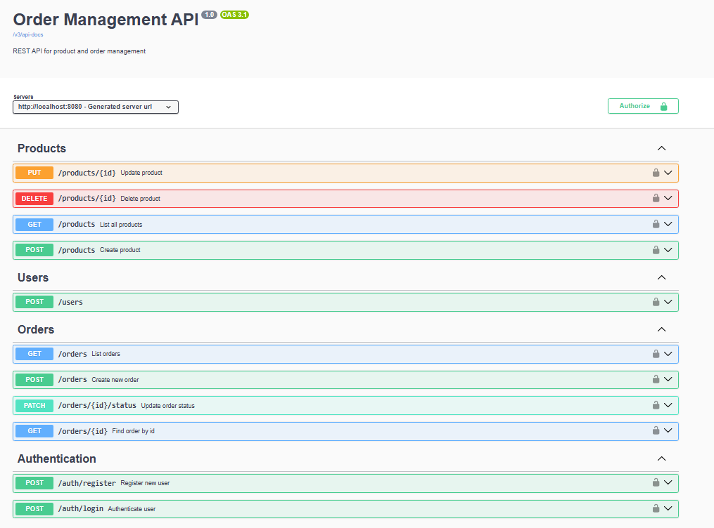

# 🚀 Order Management API

Sistema backend para gerenciamento de pedidos, produtos e usuários, desenvolvido com **Java + Spring Boot**, seguindo boas práticas de arquitetura em camadas, autenticação JWT e foco em escalabilidade, segurança e manutenção.

---

## 📷 API Documentation

Documentação interativa disponível via Swagger UI:

`http://localhost:8080/swagger-ui/index.html`



---

## 🛠 Tecnologias Utilizadas

* Java 21
* Spring Boot 4.0.5
* Spring Security
* JWT Authentication
* Spring Data JPA
* Hibernate
* PostgreSQL
* Swagger / OpenAPI
* Docker
* Maven
* JUnit 5
* Mockito
* Git / GitHub

---

## 📌 Funcionalidades

### 👤 Usuários

* Cadastro de usuários
* Login com autenticação JWT
* Controle de acesso por perfil (ADMIN / CLIENT)
* Senhas criptografadas com BCrypt

### 📦 Produtos

* Cadastro de produtos
* Listagem de produtos
* Atualização de produtos
* Remoção de produtos

### 🧾 Pedidos

* Criação de pedidos
* Associação com usuário autenticado
* Listagem de pedidos do cliente
* Listagem geral para administradores
* Atualização de status
* Consulta por ID

---

## 🔐 Segurança

A autenticação é baseada em **JWT Token**.

### Fluxo

1. Usuário se registra
2. Realiza login
3. Recebe token JWT
4. Envia token no header:

```http
Authorization: Bearer seu_token
```

5. Acessa rotas protegidas

---

## 🧱 Arquitetura do Projeto

Arquitetura em camadas:

```text
controller -> service -> repository -> database
```

Estrutura:

```text
src/main/java/com/clayton/ordermanagementapi

├── config
├── controller
├── dto
├── entity
├── exception
├── repository
├── service
```

---

## 🐳 Docker

Projeto containerizado com Docker para facilitar execução e ambiente padronizado.

```bash
docker compose up --build
```


---

## ▶️ Como Executar Localmente

### Pré-requisitos

* Java 21+
* PostgreSQL
* Maven

### Clone o projeto

```bash
git clone https://github.com/seu-usuario/order-management.git
```

### Configure o application.properties

```properties
spring.datasource.url=jdbc:postgresql://localhost:5432/order_management_db
spring.datasource.username=seu_usuario
spring.datasource.password=sua_senha
```

### Rode o projeto

```bash
mvn spring-boot:run
```

---

## 📡 Endpoints Principais

### Authentication

```text
POST /auth/register
POST /auth/login
```

### Products

```text
GET    /products
POST   /products
PUT    /products/{id}
DELETE /products/{id}
```

### Orders

```text
GET    /orders
GET    /orders/{id}
POST   /orders
PATCH  /orders/{id}/status
```

---

## 🧪 Testes

* JUnit 5
* Mockito

---

## 📈 Melhorias Futuras

* CI/CD com GitHub Actions
* Deploy em nuvem
* Testes de integração
* Logs centralizados
* Monitoramento

---

## 👨‍💻 Autor

Desenvolvido por Clayton Santos.
