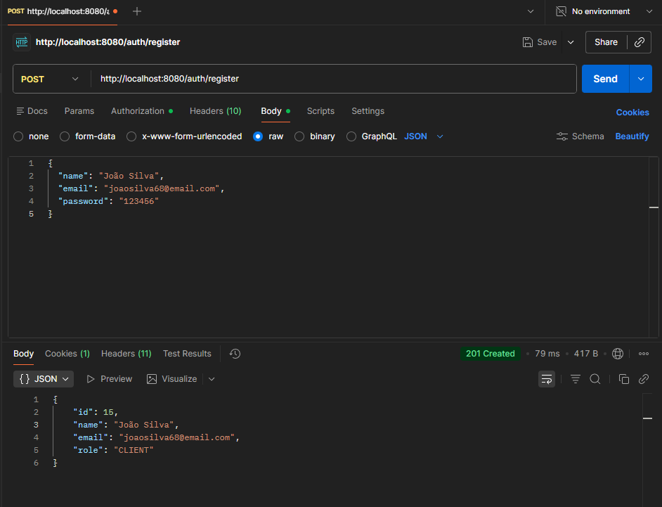
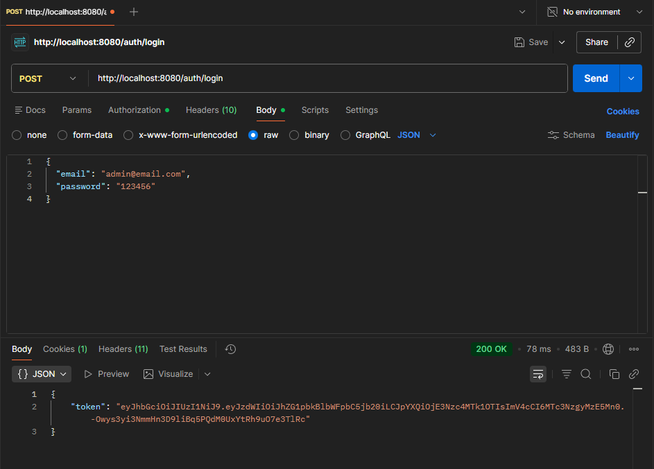
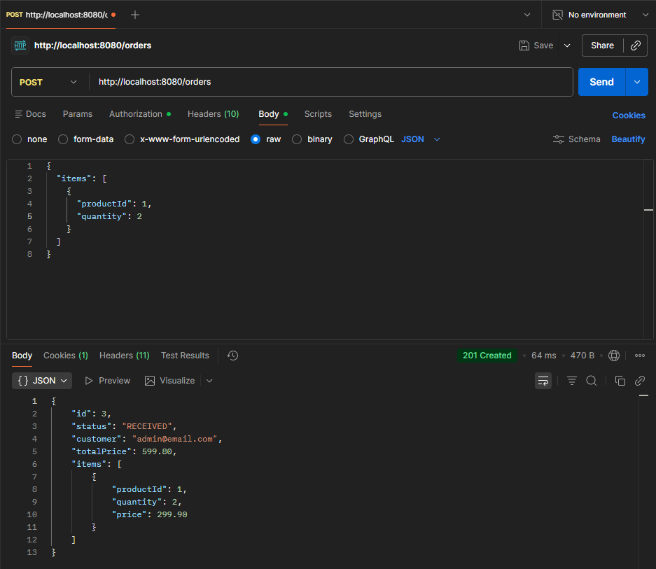
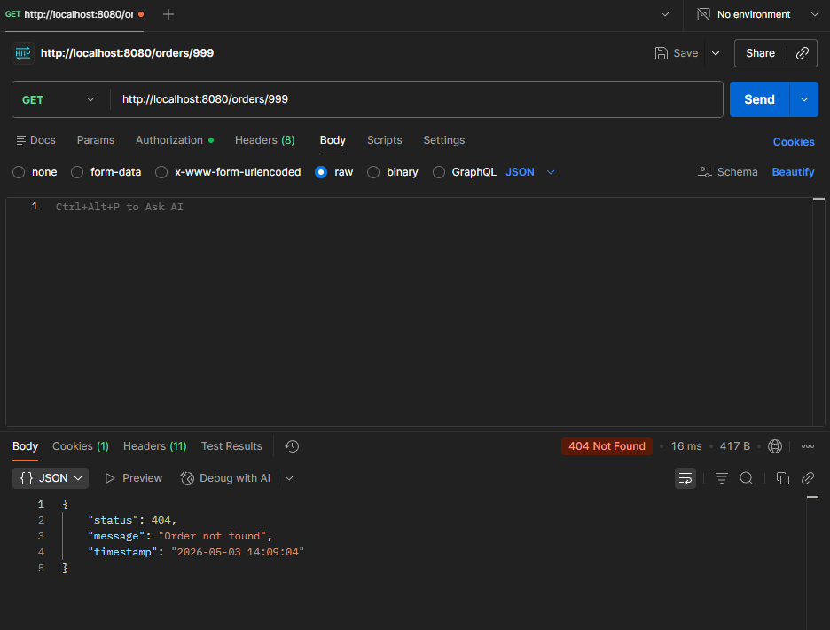
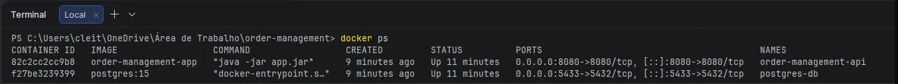
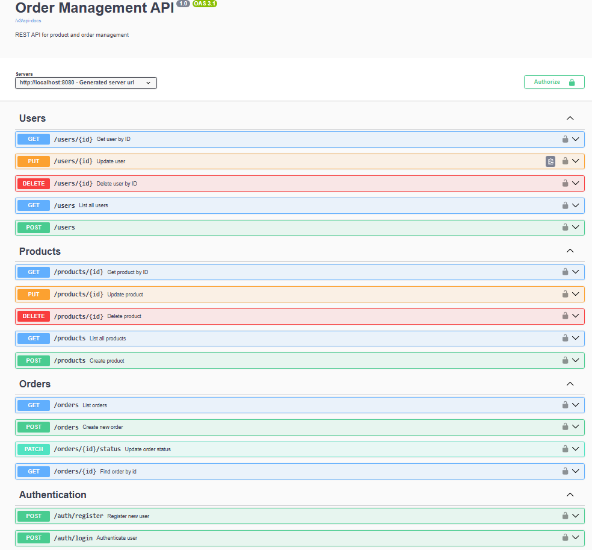

<div align="center">

# 📦 Order Management API

**API REST robusta para gerenciamento de pedidos, produtos e usuários**


</div>

---

## 📌 Sobre o Projeto

API desenvolvida com **Java 21 + Spring Boot** para gerenciamento completo de pedidos, com autenticação JWT, controle de acesso por perfis e containerização via Docker.

O projeto aplica boas práticas como arquitetura em camadas, tratamento global de exceções, documentação OpenAPI e testes unitários e de integração com JUnit e Mockito.

---

## 🖼️ Preview

### 📬 Cadastro de Usuário


### 🔐 Login e Token JWT


### 🧾 Criação de Pedido


### 🔄 Atualização de Status


### ❌ Erro 404 - Pedido não encontrado


### 🐳 Containers Docker


### 📄 Swagger UI


---

## 🛠️ Tecnologias

| Categoria | Tecnologias |
|-----------|------------|
| Linguagem | Java 21 |
| Framework | Spring Boot, Spring Security, Spring Data JPA |
| Banco de Dados | PostgreSQL 15 |
| Autenticação | JWT (JSON Web Token) + BCrypt |
| Documentação | Swagger / OpenAPI |
| Testes | JUnit 5, Mockito |
| DevOps | Docker, Docker Compose |
| Build | Maven |

---

## ✅ Funcionalidades

### 👤 Usuários & Autenticação
- Cadastro e login de usuários
- Autenticação via **JWT Token**
- Controle de acesso por perfil: `ADMIN` e `CLIENT`
- Senhas criptografadas com **BCrypt**

### 📦 Produtos
- CRUD completo de produtos
- Acesso restrito por perfil

### 🧾 Pedidos
- Criação de pedidos vinculados ao usuário autenticado
- Listagem dos próprios pedidos (CLIENT)
- Listagem geral de todos os pedidos (ADMIN)
- Atualização de status do pedido
- Consulta por ID com tratamento de erro `404`

---

## 🔐 Autenticação JWT

```
1. POST /auth/register  →  Cria o usuário
2. POST /auth/login     →  Retorna o token JWT
3. Envie o token nas requisições protegidas:
```

```http
Authorization: Bearer <seu_token>
```

---

## 🏗️ Arquitetura

```
controller → service → repository → database
```

```
src/main/java/com/clayton/ordermanagementapi
├── config          # Configurações de segurança e beans
├── controller      # Camada de entrada (endpoints REST)
├── dto             # Objetos de transferência de dados
├── entity          # Entidades JPA
├── exception       # Tratamento global de erros
├── repository      # Acesso ao banco de dados
└── service         # Regras de negócio
```

---

## 📡 Endpoints

### 🔑 Auth
| Método | Rota | Descrição | Auth |
|--------|------|-----------|------|
| `POST` | `/auth/register` | Cadastro de usuário | ❌ |
| `POST` | `/auth/login` | Login e geração do token | ❌ |

### 📦 Products
| Método | Rota | Descrição | Auth |
|--------|------|-----------|------|
| `GET` | `/products` | Lista produtos | ✅ |
| `POST` | `/products` | Cria produto | ✅ ADMIN |
| `PUT` | `/products/{id}` | Atualiza produto | ✅ ADMIN |
| `DELETE` | `/products/{id}` | Remove produto | ✅ ADMIN |

### 🧾 Orders
| Método | Rota | Descrição | Auth |
|--------|------|-----------|------|
| `GET` | `/orders` | Lista pedidos | ✅ |
| `GET` | `/orders/{id}` | Busca por ID | ✅ |
| `POST` | `/orders` | Cria pedido | ✅ |
| `PATCH` | `/orders/{id}/status` | Atualiza status | ✅ ADMIN |

---

## 🐳 Rodando com Docker

> Pré-requisito: ter **Docker** instalado.

```bash
# Clone o repositório
git clone https://github.com/ClaytonBC/order-management.git
cd order-management

# Suba os containers
docker compose up --build
```

A API estará disponível em: `http://localhost:8080`

---

## 💻 Rodando Localmente (sem Docker)

**Pré-requisitos:** Java 21+, PostgreSQL, Maven

```bash
# Clone o repositório
git clone https://github.com/ClaytonBC/order-management.git
cd order-management
```

Crie um arquivo `.env` com as variáveis:
```env
SPRING_DATASOURCE_URL=jdbc:postgresql://localhost:5432/order_management_db
SPRING_DATASOURCE_USERNAME=seu_usuario
SPRING_DATASOURCE_PASSWORD=sua_senha
```

```bash
mvn spring-boot:run
```

---

## 📄 Documentação

Acesse a documentação interativa via Swagger:

```
http://localhost:8080/swagger-ui/index.html
```

---

## 🧪 Testes

```bash
mvn test
```

- **Testes Unitários** — JUnit 5 + Mockito (camada de Service)
- **Testes de Integração** — Spring Boot Test (camada de Controller)

---

## 🚀 Melhorias Futuras

- [ ] CI/CD com GitHub Actions
- [ ] Deploy em nuvem (Railway / Render / AWS)
- [ ] Paginação nos endpoints de listagem
- [ ] Logs centralizados

---

## 👨‍💻 Autor

<div align="center">

**Clayton Santos**
Desenvolvedor Backend Java | Spring Boot | APIs REST

[](https://www.linkedin.com/in/claytonsantosdev)
[](https://github.com/ClaytonBC)

</div>
